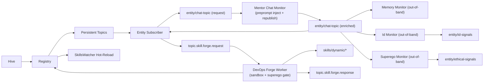

# Abigail Architecture

## Skill Topology and Forge Flow

```mermaid
flowchart LR
    Hive[Hive] --> Registry[Registry]
    Registry --> Topics[Persistent Topics]
    Topics --> Entity[Entity Subscriber]
    Entity --> ChatReq["entity/chat-topic (request)"]
    ChatReq --> Mentor["Mentor Chat Monitor<br/>(preprompt inject + republish)"]
    Mentor --> ChatEnriched["entity/chat-topic (enriched)"]
    ChatEnriched --> Entity
    ChatEnriched --> MemoryOob["Memory Monitor (out-of-band)"]
    ChatEnriched --> IdOob["Id Monitor (out-of-band)"]
    ChatEnriched --> SuperegoOob["Superego Monitor (out-of-band)"]
    IdOob --> IdSignals["entity/id-signals"]
    SuperegoOob --> EthicalSignals["entity/ethical-signals"]
    Entity --> ForgeReq["topic.skill.forge.request"]
    ForgeReq --> ForgeWorker["DevOps Forge Worker<br/>(sandbox + superego gate)"]
    ForgeWorker --> Dynamic["skills/dynamic/*"]
    ForgeWorker --> Registry
    Registry --> Watcher["SkillsWatcher Hot-Reload"]
    ForgeWorker --> ForgeResp["topic.skill.forge.response"]
```

This diagram is the canonical high-level flow for persistent skill topology provisioning and Forge-driven capability evolution.
