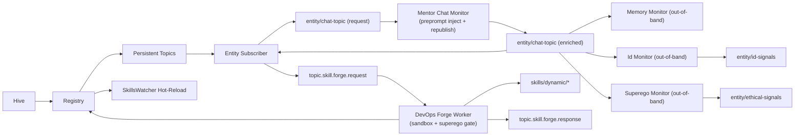

# Abigail Architecture

## Skill Topology and Forge Flow

This diagram is the canonical high-level flow for persistent skill topology provisioning and Forge-driven capability evolution.

## Hive-Owned Memory Store

- `Abigail Hive` opens the shared local SurrealDB store before user-facing Entities start.
- Shared orchestration records live in namespace `abigail`, database `hive`.
- Per-Entity state lives in namespace `abigail`, database `entity_<uuid>`.
- The Hive daemon is the only process opening the embedded SurrealKV engine. Entity runtimes call `/v1/entities/:id/persistence` with their Hive-issued runtime lease; the server verifies that the lease matches the requested Entity scope.
- The coordinator's conversation also has its own Entity database. Background jobs are scoped per Entity so starting one runtime cannot recover or consume another runtime's jobs.
- The memory path is local-first and desktop-native, with legacy SQLite files used only as first-launch migration inputs.
- Queue state, protected-topic capture, calendar data, knowledge-base entries, and chat memory now share the same persistence substrate so reflection and enrichment jobs can query across those layers without cross-database glue code.

## Runnable Windows MVP

The unsigned installer bundles the Hive shell, Entity Runtime shell, and both daemons. Both frontend shells use Tauri's custom protocol with embedded assets; installed apps do not depend on Vite. Hive starts its daemon and opens a Runtime window on demand while remaining available.

Entity setup writes and signs its constitutional documents before marking birth complete. The chat UI restores server-side conversation history rather than relying on a port-specific browser cache. Provider settings are refreshed at conversation entry so setup does not leave already-running Entities on a stale model.

Local inference requires a loaded local server. Optional cloud processing sends conversation content and context to the selected provider. Hive owns all provider selection, including installed official Claude, Codex, and Grok CLI account connections; Gemini CLI remains unsupported. A desktop installation alone is not treated as an inference connection.

CLI discovery is passive and reports installation/authentication hints without model inference. Explicit selection calls a bounded real completion probe and saves the Hive default only after a successful nonempty reply. The official CLI owns sign-in, token storage, and refresh; Abigail does not extract or forward account OAuth tokens. Entity routing and resolved subagent profiles use the same supported-provider gate.

The CLI adapters provide chat-only inference in an isolated request directory. Native tools and automatically discovered MCP, hooks, plugins, and other extensions are disabled or rejected when isolation cannot be established; user CLI settings are not rewritten. Provider errors become fixed sign-in, usage-limit, version, model, or isolation guidance rather than raw diagnostics. Automated skill calls do not bypass tools' confirmation requirements.

Codex uses an owned app-server subprocess with cached CLI authentication. Grok uses an owned ACP subprocess; existing-account mode consumes authentication established by `initialize`/`session/new` and never calls `authenticate`, because the vendor's `cached_token` handler can fall back to interactive login. Grok must confirm an empty native toolset before any prompt, reject native tool activity, and return successful completion before emitting `done`.

Installed Codex `0.153.4` passed 11 actual model/persistence stages without an injected API key, with selected-provider traces showing no fallback and exact conversation restoration after Entity/Hive restart. Grok Build `0.2.93` passed four negative authentication stages without persisting a default; real inference remains pending user sign-in. The updated installed daemon contract passed 12 stages. The final verified package retains identical daemons and Runtime GUI and embeds a Hive GUI with improved small-window scrolling; exact payload evidence is recorded in `docs/MVP_WINDOWS.md`.

The final installed desktop passed eight workflow stages, including Codex chat with Nova and exact prompt/reply restoration after Runtime reopening while Hive remained usable. Selecting Grok with missing sign-in preserved the existing Codex connection. Claude passed four negative connection stages without saving a default; a separate scalar diagnostic confirmed authentication required (HTTP 401). Real Grok and Claude inference remain pending user sign-in.

Claude Code runs unmodified under [Anthropic's product-use conditions](https://code.claude.com/docs/en/legal-and-compliance#can-customers-offer-claude-code-in-their-products). The current Codex account integration targets local/open-source use; [OpenAI's app-server authentication guidance](https://learn.chatgpt.com/docs/app-server#auth-endpoints) requires the applicable approved Sign in with ChatGPT path for commercial or hosted products. Live installed-CLI acceptance is recorded separately from prior local-model acceptance in `docs/MVP_WINDOWS.md`.
