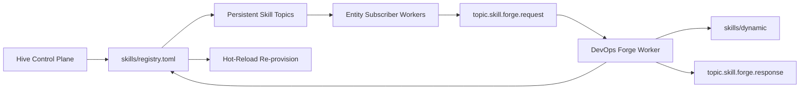

# Architecture: Skill Topology and Forge

**Status:** Canonical specification  
**Version:** 1.1  
**Date:** 2026-03-05

This document is the single source of truth for skill topology provisioning and Forge orchestration across the Sovereign stack.

## 1. Purpose

Define a stable runtime model where:

- Skill topology is provisioned as persistent request/response topics at startup.
- Registry ownership, runtime execution, and Forge authoring are separated by clear boundaries.
- Superego-style safety gates are enforced as policy boundaries, not ad hoc prompt logic.
- Hot-reload updates topology safely on `registry.toml` changes.

## 2. Canonical Topology Model

For each enabled skill in `skills/registry.toml`, runtime MUST provision:

- `topic.skill.{name}.request`
- `topic.skill.{name}.response`

Where `{name}` is a topic-safe form of the registry skill ID.

Each provisioned skill has:

- A dedicated consumer group: `skill-worker.{name}`
- An isolated subscriber worker bound to the request topic
- A deterministic response topic for tool/result envelopes

Provisioning is idempotent and safe to run repeatedly.

## 3. Separation of Concerns

### Hive (control plane)

- Owns provider secrets and authoritative policy controls.
- Publishes system-level configuration and registry artifacts.
- Does not execute per-skill work loops directly.

### Registry (contract plane)

- `skills/registry.toml` is the declarative skill topology contract.
- Declares enabled skill IDs and instruction mappings.
- Is the only source used for persistent topic provisioning.

### Entity Subscriber (runtime plane)

- Provisions persistent skill topics from the registry at startup.
- Runs skill workers as isolated subscribers.
- Handles request/response message execution flow.

### Forge (authoring plane)

- Creates/updates/removes skills through controlled factory tools.
- Produces artifacts that must round-trip through the registry contract.
- Never bypasses registry consistency checks.

## 4. Forge Pipeline (Canonical)

1. Intent classification identifies a persistent capability need.
2. Entity publishes code + markdown envelope to `topic.skill.forge.request`.
3. DevOps Forge worker performs sandbox checks and Superego gate scan.
4. Forge writes artifacts to `skills/dynamic/` and mirrors instruction markdown for prompt loading.
5. Forge updates/touches `skills/registry.toml` and publishes `topic.skill.forge.response`.
6. Watcher detects registry change and re-provisions persistent topology from registry.
7. Skill worker becomes available via request/response topics.

## 5. Superego Gates (Policy Boundaries)

Superego gates are modeled as policy decisions at execution boundaries:

- **Gate A: Registry mutation**
  Require elevated approval for high-risk additions (shell/network-wide/system scope).
- **Gate B: Permission expansion**
  Block or require approval when a forged skill broadens permissions unexpectedly.
- **Gate C: Runtime execution**
  Apply risk/interception policy before executing high-risk tool calls.
- **Gate D: Secret access**
  Restrict secret namespaces; inject only what a declared skill requires.

Gate outcomes:

- `allow`
- `allow_with_audit`
- `require_mentor_approval`
- `deny`

## 6. Hot-Reload Rules

Watcher behavior MUST include:

- Skill artifact changes (`skill.toml`, `*.json`) for runtime registration updates.
- `registry.toml` changes for topology re-provisioning.

On registry change:

1. Cancel existing persistent worker subscriptions.
2. Re-parse enabled skills from registry.
3. Re-provision topics and worker subscriptions.
4. Emit operational logs/events for traceability.

On registry removal:

- Cancel active topology workers and enter degraded mode until registry is restored.

## 7. Operational Invariants

- No dynamic-only runtime assumption is allowed in architecture docs or planning artifacts.
- Persistent topology is startup- and registry-driven, not message-driven.
- Registry is authoritative for skill topology scope.
- Forge outputs are invalid unless reflected in the registry contract.
- Re-provision must be safe under repeated or bursty file events.

## 8. Diagram

